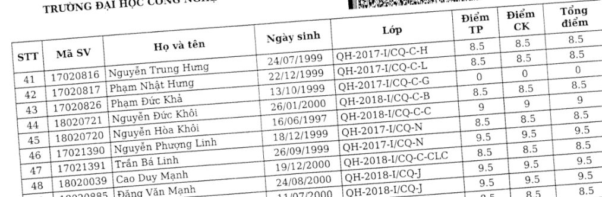

# viewgrade
This tool counts the grades in pdf docs from http://112.137.129.30/viewgrade/ (an UET site for grades publication)<br>
It should work fine on the **majority** of the pdf docs with **acceptable** accuracy.<br>
Typically takes **2-10s** or more for each pdf doc, depending on the number pages and grades.



#### Console Example
```console
ncthuan:~$ python viewgrade.py

Enter path: http://112.137.129.30/viewgrade/public/upload/051926290121Du%20an%20cong%20nghe_INT3132%2020_0001.pdf

Total recognized: 73
Grade: %
 A+  : 65
 A   : 9
 B+  : 6
 B   : 2
 C+  : -
 C   : -
 D+  : 6
 D   : -
 F   : 6
 N/A : 1

Enter path: q

ncthuan:~$
```

## Installation
requirements:
* opencv
* numpy
* tesseract
* pytesseract
* pdf2image
* poppler

Yall gonna need an environment that has those packages above to run the code.<br>
Personally, I use annaconda or miniconda on Windows 10 so I might use the following commands:
```
conda install -c conda-forge tesseract
conda install -c conda-forge poppler
pip install pytesseract
pip install pdf2image
pip install opencv
```


## Usage
#### Command
```
python viewgrade.py
```
* then paste in the url or local file path
* enter "q" to quit

## How it works
It uses OpenCV image processing APIs to extract grades' bounding boxes and then passes them to tesseract for OCR.<br>
Check out the notebook **experiment.ipynb** for more details

## Sample data
data/sample/

## To do
* [x] function: send request to the server to get pdf files as bytes
* [x] enter path as a url, while loop
* [ ] further testing and config fine tuning
* [ ] try other OCR approaches
* [ ] try deep learning